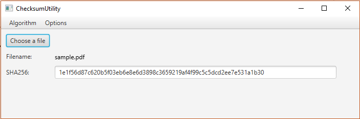

[](https://opensource.org/licenses/MIT)

# Checksum Utility

A simple checksum utility written in Kotlin that allow to compute hash using several algorithm. It uses JavaFX to build the UI.

### Prerequisites

* [Maven](https://maven.apache.org/) - Dependency Management

### Compiling

Compile the project with:

```
mvn package
```

## Running

Run the utility:

```
java -jar target\checksum-utility-0.3-jar-with-dependencies.jar alessmar.Calculator
```


